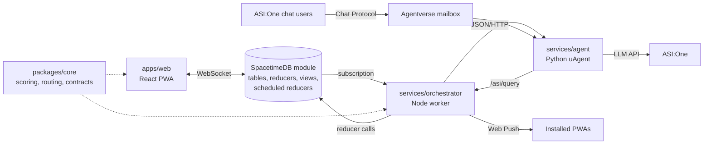

# ProxiPrompt

**Nearby humans as queryable, uncertainty-aware sensors.** Ask about a place's current conditions. An agent decides what evidence it needs, checks fresh reports, asks the fewest useful people physically near that place only if needed, and answers with confidence and provenance. With no fresh evidence it says so instead of guessing.

MHacks '26. Tracks: Actually Intelligent, Fetch.ai ASI:One Agent Challenge, Best Use of SpacetimeDB. Team: Paul, Jerry, Shiyuan, Chinmay.

Docs:

- [`SPEC.md`](SPEC.md): the product and architecture contract.
- [`DEMO.md`](DEMO.md): the 3-minute judge demo script.
- [`DEVPOST.md`](DEVPOST.md): submission text.
- [`PROGRESS.md`](PROGRESS.md): operational state and handoff ledger.
- [`services/agent/README.md`](services/agent/README.md): the Agentverse agent profile.

Agentverse profile: https://agentverse.ai/agents/details/agent1q2n246t50502rk048qful37rqmf3sv9yna6z9gsdlynr3lqrcmzhj7p3ncs/profile

## Architecture



```
apps/web                 installable PWA
packages/core            scoring, routing, freshness, contracts (pure TS)
spacetimedb              authoritative state machine and rules
services/orchestrator    subscription worker, Web Push, ASI bridge
services/agent           Fetch.ai uAgent (plan / synthesize / Chat Protocol)
```

The database holds state, enforces every safety rule, and runs the clocks (job deadlines, prompt and watch expiry, cleanup). The orchestrator reacts to rows and does the network work. The agent plans, reviews and writes with ASI:One. See SPEC section 2.

## Quickstart

Prerequisites: Node 24 and pnpm 11, [uv](https://docs.astral.sh/uv/) (Python 3.12 is pinned and uv fetches it), and the SpacetimeDB CLI (2.x) at `~/.local/bin/spacetime`.

```bash
pnpm install
cd services/agent && uv sync && cd ../..
pnpm dev
```

`pnpm dev` (`scripts/dev.sh`) starts SpacetimeDB (:3000), the agent (:8001), the orchestrator (:8080) and the web app (:5173). Stop with `pnpm stop` or Ctrl+C.

### Env files

All are git-ignored; copy from the `.env.example` next to each. `scripts/dev.sh` loads the agent and orchestrator files.

| File | Keys |
|---|---|
| `services/agent/.env` | `ASI_ONE_API_KEY` (without it the agent uses a labeled heuristic planner), `AGENT_SEED` (stable; sets the agent address), `AGENT_MAILBOX=1` for Agentverse, `AGENT_HANDLE` |
| `services/orchestrator/.env` | `VAPID_PUBLIC_KEY`, `VAPID_PRIVATE_KEY`, `VAPID_SUBJECT` for Web Push. Keep only these lines; copying the whole example turns Bluesky on |
| `apps/web/.env` | `VITE_VAPID_PUBLIC_KEY`, `VITE_SPACETIMEAUTH_CLIENT_ID` (optional), `VITE_GOOGLE_MAPS_API_KEY` (optional) |

Generate VAPID keys with `npx web-push generate-vapid-keys`. `ORCH_BRIDGE_TOKEN` (orchestrator and agent) is optional locally and required before binding the orchestrator to `0.0.0.0`.

### Two tabs, two people

- Asker: http://localhost:5173/
- Responder: http://127.0.0.1:5173/

The hosts do not share a login. On the responder tab, open **You** and set a demo location at the place being asked about. Only GPS acquisition is simulated; distance, eligibility and push use the real pipeline. Details and a script: [`DEMO.md`](DEMO.md).

### Auth

If `VITE_SPACETIMEAUTH_CLIENT_ID` is set, the app shows a SpacetimeAuth email sign-in plus **Use demo session** (a browser-only, labeled dev identity). Put the SpacetimeAuth client ID in `apps/web/.env` as `VITE_SPACETIMEAUTH_CLIENT_ID=<client id>`, and register redirect URIs `http://localhost:5173/callback` and `http://127.0.0.1:5173/callback` (plus your ngrok `/callback` if you use one). If it is unset, **Explore the demo** creates the dev session directly.

### MainCloud mode

```bash
STDB_TARGET=maincloud pnpm dev
```

Uses the hosted database `proxiprompt-mhacks` and skips local SpacetimeDB. It refuses a MainCloud database that does not have our worker token, because the first identity to claim the service role on a public database becomes the worker. Dashboard: https://spacetimedb.com/proxiprompt-mhacks

### Demo scripts

Simulated neighbors (bot residents with `_sim` usernames that answer prompts after 3 to 12 s, so one person can demo alone). Run with the stack up:

```bash
pnpm demo:neighbors -- --db proxiprompt --count 8 --seed-posts                    # local
pnpm demo:neighbors --uri wss://maincloud.spacetimedb.com --db proxiprompt-mhacks --count 8   # MainCloud, answers arrive live
```

Flags: `--uri`, `--db`, `--count` (default 8, max 40), `--seed-posts` (adds Live Pulse posts; repeat questions then answer from cache), `--min-delay` / `--max-delay`. Details: [`services/orchestrator/README.md`](services/orchestrator/README.md).

Rehearsal asker (scripted questions against a hosted test database; it refuses `proxiprompt-mhacks`). It needs an orchestrator and `demo:neighbors` on the same database:

```bash
pnpm --filter @proxiprompt/orchestrator exec tsx scripts/rehearse.ts --uri wss://maincloud.spacetimedb.com --db proxiprompt-mhacks-test
```

It reports time to first prompt, time to answered, final status, evidence count and confidence per question. The full solo recipe with timings is in [`DEMO.md`](DEMO.md).

## Tests

```bash
pnpm --filter @proxiprompt/core test           # scoring, routing, freshness
pnpm --filter @proxiprompt/orchestrator test   # state machine against a fake database
cd services/agent && uv run pytest             # planner, input handling, chat bridge, REST
pnpm --filter @proxiprompt/spacetimedb publish:test
pnpm --filter @proxiprompt/spacetimedb guardrails   # 72 checks against proxiprompt-test
pnpm e2e:browser                               # SPEC section 14 in four Chromium contexts
pnpm typecheck
```

The guardrail and browser suites need local SpacetimeDB and the agent running, and use the separate `proxiprompt-test` database. Never point test scripts at the live `proxiprompt` database. Last recorded results are in `PROGRESS.md`.
